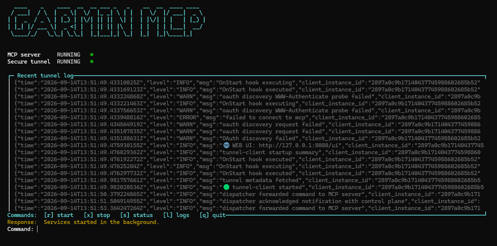

# Garmin MCP

Read Garmin Connect health, activity, profile, device, and body-battery data through:

- a simple local CLI/dashboard;
- an MCP server for ChatGPT or another MCP client.

The MCP server also exposes per-distance/per-lap splits for individual activities.



The MCP tools are read-only. Garmin login tokens are cached locally in
`~/.garminconnect`; never commit `.env` or token files.

## Run

```bash
source .venv/bin/activate
./garmin-mcp
```

The dashboard starts the MCP server and secure tunnel in the background. Use:

```text
r  start services
x  stop services
s  refresh status
l  show logs
q  quit dashboard
```

For one-off commands:

```bash
./garmin-mcp status
./garmin-mcp test
./garmin-mcp doctor
```

## ChatGPT MCP connection

The dashboard must show both services as running/ready/connected. In ChatGPT,
add a custom MCP connector using the configured tunnel ID. The tunnel forwards
ChatGPT to the local endpoint:

```text
http://127.0.0.1:8000/mcp
```

If the tunnel or MCP process stops, ChatGPT cannot reach Garmin until the
dashboard is started again.

## First login and configuration

On the first Garmin request, enter the Garmin email/password when prompted.
Credentials and tunnel settings may be placed in a local `.env` file; copy
`.env.example` and fill it in. Keep `.env` private.

## Useful direct commands

```bash
./garmin-mcp run
python mcp_server.py --transport streamable-http
```

The server listens locally on `127.0.0.1:8000` and exposes `/mcp`.
